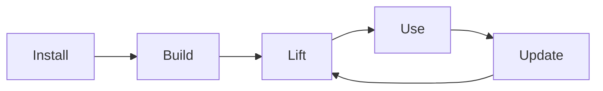

# rpg-encoder

[](https://github.com/userFRM/rpg-encoder/actions)
[](LICENSE)
[](https://www.rust-lang.org)

> [!NOTE]
> This is an **independent, community-driven implementation** inspired by the
> [RPG-Encoder paper](https://arxiv.org/abs/2602.02084) from Microsoft Research. It is **not**
> affiliated with, endorsed by, or connected to Microsoft in any way. For the official
> implementation, see [microsoft/RPG-ZeroRepo](https://github.com/microsoft/RPG-ZeroRepo).
>
> Microsoft announced *"We are in the process of preparing a full public release of the codebase,
> and all code will be released within the next two weeks."* — that was too long to wait.
> This project was built with Claude by reading the publicly available research papers and
> implementing the described algorithms from scratch in Rust. All code is original work.
> The papers are cited for attribution.

---

**Coding agent toolkit for semantic code understanding.**

rpg-encoder builds a semantic graph of your codebase. Your coding agent (Claude Code, Cursor,
etc.) analyzes the code and adds intent-level features via the MCP interactive protocol.
Search by what code *does*, not what it's named.

> [!TIP]
> **New to RPG?** See [How RPG Compares](docs/comparison.md) to understand where it fits
> alongside Claude Code, Serena, and other tools.
> For a detailed algorithm-by-algorithm comparison with the research paper, see
> [Paper Fidelity](docs/paper_fidelity.md).

## Install

The MCP server automatically detects the project root — no path argument needed.

Add to your MCP config (Claude Code `~/.claude.json`, Cursor settings, opencode, etc.):

```json
{
  "mcpServers": {
    "rpg": {
      "command": "npx",
      "args": ["-y", "-p", "rpg-encoder", "rpg-mcp-server"]
    }
  }
}
```

> [!TIP]
> The path argument is optional. When omitted, the server falls back to the current working directory.
> MCP clients (like opencode, Claude Code, Cursor) launch the server from the workspace directory,
> so `current_dir()` automatically points to your project. If you pass a path explicitly, it will use that instead.

<details>
<summary>Alternative: build from source</summary>

```bash
git clone https://github.com/userFRM/rpg-encoder.git
cd rpg-encoder && cargo build --release
```

Then use the binary path directly:

```json
{
  "mcpServers": {
    "rpg": {
      "command": "/path/to/rpg-encoder/target/release/rpg-mcp-server"
    }
  }
}
```

> [!TIP]
> The binary also accepts an optional path argument. Omit it to use the current working directory.

</details>

<details>
<summary><strong>Multi-repo setup</strong></summary>

The path argument is optional — the server defaults to the current working directory. This works
automatically because MCP clients launch the server from the workspace directory.

**Global config (all repos use cwd)**

No path needed — each session uses the directory where the MCP client was started:

```json
{
  "mcpServers": {
    "rpg": {
      "command": "npx",
      "args": ["-y", "-p", "rpg-encoder", "rpg-mcp-server"]
    }
  }
}
```

**Per-project override (explicit path)**

If you need a specific repo, pass the path:

```json
{
  "mcpServers": {
    "rpg": {
      "command": "npx",
      "args": ["-y", "-p", "rpg-encoder", "rpg-mcp-server", "/path/to/this/repo"]
    }
  }
}
```

The project-level config overrides the global one. Restart Claude Code after creating/modifying configs.

</details>

## Lifecycle



You install it. Your agent does the rest.

## Getting Started

Tell your coding agent:

> "Build and lift the RPG for this repo"

That's it. The agent handles everything. Here's what happens:

1. **Build** — Indexes all code entities and dependencies (~5 seconds)
2. **Lift** — Agent analyzes each function/class and adds semantic features (~2 min per 100 entities)
3. **Organize** — Agent discovers functional domains and builds a semantic hierarchy (~30 seconds)
4. **Save** — Graph is written to `.rpg/graph.json` — commit it so everyone benefits

Once lifted, try queries like:

- *"What handles authentication?"*
- *"Show me everything that depends on the database connection"*
- *"Plan a change to add rate limiting to API endpoints"*

<details>
<summary><strong>How it works under the hood</strong></summary>

The RPG (Repository Planning Graph) is a hierarchical, dual-view representation from the
research papers cited below:

1. **Parse** — Extract entities (functions, classes, methods) and dependency edges (imports,
   invocations, inheritance) using tree-sitter. Build a file-path hierarchy.
2. **Lift** — Your coding agent analyzes entity source code and adds verb-object semantic
   features (e.g., "validate user credentials", "serialize config to disk") via the MCP
   interactive protocol (`get_entities_for_lifting` → `submit_lift_results`).
3. **Hierarchy** — Your agent discovers functional domains and assigns entities to a 3-level
   semantic hierarchy (`build_semantic_hierarchy` → `submit_hierarchy`).
4. **Ground** — Anchor hierarchy nodes to directories via LCA algorithm, resolve cross-file
   dependency edges.

The graph is saved to `.rpg/graph.json` and **should be committed to your repo** — this way
all collaborators and AI tools get instant semantic search without rebuilding.

</details>

## MCP Tools

**Build & Maintain**

| Tool | Description |
|------|-------------|
| `build_rpg` | Index the codebase (run once, instant) |
| `update_rpg` | Incremental update from git changes |
| `reload_rpg` | Reload graph from disk after external changes |
| `rpg_info` | Graph statistics, hierarchy overview, per-area lifting coverage |

**Semantic Lifting**

| Tool | Description |
|------|-------------|
| `lifting_status` | Dashboard — coverage, per-area progress, NEXT STEP |
| `get_entities_for_lifting` | Get entity source code for your agent to analyze |
| `submit_lift_results` | Submit the agent's semantic features back to the graph |
| `finalize_lifting` | Aggregate file-level features, rebuild hierarchy metadata |
| `get_files_for_synthesis` | Get file-level entity features for holistic synthesis |
| `submit_file_syntheses` | Submit holistic file-level summaries |
| `build_semantic_hierarchy` | Get domain discovery + hierarchy assignment prompts |
| `submit_hierarchy` | Apply hierarchy assignments to the graph |
| `get_routing_candidates` | Get entities needing semantic routing (drifted or newly lifted) |
| `submit_routing_decisions` | Submit routing decisions (hierarchy path or "keep") |

**Navigate & Search**

| Tool | Description |
|------|-------------|
| `search_node` | Search entities by intent or keywords (hybrid embedding + lexical scoring) |
| `fetch_node` | Get entity metadata, source code, dependencies, and hierarchy context |
| `explore_rpg` | Traverse dependency graph (upstream, downstream, or both) |
| `context_pack` | Single-call search+fetch+explore with token budget |

**Plan & Analyze**

| Tool | Description |
|------|-------------|
| `impact_radius` | BFS reachability analysis — "what depends on X?" |
| `plan_change` | Change planning — find relevant entities, modification order, blast radius |
| `find_paths` | K-shortest dependency paths between two entities |
| `slice_between` | Extract minimal connecting subgraph between entities |
| `reconstruct_plan` | Dependency-safe reconstruction execution plan |

### Lifting: What It Is

Lifting is the process where your coding agent reads each function, class, and method in your
codebase and describes what it does in plain English — verb-object features like "validate user
credentials" or "serialize config to disk". These features power semantic search: find code by
what it *does*, not what it's named.

- **No API keys needed** — your connected coding agent (Claude Code, Cursor, etc.) *is* the LLM
- **One-time cost** — lift once, commit `.rpg/`, and every future session starts instantly
- **Resumable** — if interrupted, `lifting_status` picks up exactly where you left off
- **Incremental** — after code changes, `update_rpg` detects what moved and only re-lifts those entities
- **Scoped** — lift the whole repo or just a subdirectory (`"src/auth/**"`)

<details>
<summary><strong>Lifting protocol details (for tool builders)</strong></summary>

1. Ask your agent to "lift the code" (or call `get_entities_for_lifting` with a scope)
2. The tool returns entity source code with analysis instructions
3. Your agent analyzes the code and calls `submit_lift_results` with semantic features
4. The agent continues through all batches automatically, dispatching subagents for large repos
5. After lifting, `finalize_lifting` → `build_semantic_hierarchy` → `submit_hierarchy`

</details>

## Supported Languages

| Language | Entity Extraction | Dependency Resolution |
|----------|------------------|----------------------|
| Python | Functions, classes, methods | imports, calls, inheritance |
| Rust | Functions, structs, traits, impl methods | use statements, calls, trait impls |
| TypeScript | Functions, classes, methods, interfaces | imports, calls, inheritance |
| JavaScript | Functions, classes, methods | imports, calls, inheritance |
| Go | Functions, structs, methods, interfaces | imports, calls |
| Java | Classes, methods, interfaces | imports, calls, inheritance |
| C | Functions, structs | includes, calls |
| C++ | Functions, classes, methods, structs | includes, calls, inheritance |
| C# | Classes, methods, interfaces | using, calls, inheritance |
| PHP | Functions, classes, methods | use, calls, inheritance |
| Ruby | Classes, methods, modules | require, calls, inheritance |
| Kotlin | Functions, classes, methods | imports, calls, inheritance |
| Swift | Functions, classes, structs, protocols | imports, calls, inheritance |
| Scala | Functions, classes, objects, traits | imports, calls, inheritance |
| Bash | Functions | source, calls |

<details>
<summary><strong>CLI</strong></summary>

The CLI provides structural operations (no semantic lifting — use the MCP server for that).

```bash
# Install
npm install -g rpg-encoder

# Build a graph
rpg-encoder build
rpg-encoder build --include "src/**/*.py" --exclude "tests/**"

# Query
rpg-encoder search "parse entities from source code"
rpg-encoder fetch "src/parser.rs:extract_entities"
rpg-encoder explore "src/parser.rs:extract_entities" --direction both --depth 2
rpg-encoder info

# Incremental update
rpg-encoder update
rpg-encoder update --since abc1234

# Paper-style reconstruction schedule (topological + coherent batches)
rpg-encoder reconstruct-plan --max-batch-size 8 --format text
rpg-encoder reconstruct-plan --format json

# Pre-commit hook (auto-updates graph on every commit)
rpg-encoder hook install
```

</details>

<details>
<summary><strong>Configuration</strong></summary>

Create `.rpg/config.toml` in your project root (all fields optional):

```toml
[encoding]
batch_size = 50             # Entities per lifting batch
max_batch_tokens = 8000     # Token budget per batch
drift_threshold = 0.5       # Jaccard distance midpoint reference
drift_ignore_threshold = 0.3  # Below: minor edit, in-place update
drift_auto_threshold = 0.7    # Above: auto-queue for re-routing

[navigation]
search_result_limit = 10
```

</details>

<details>
<summary><strong>Architecture</strong></summary>

```
rpg-encoder/
├── rpg-core        Core graph types (RPGraph, Entity, HierarchyNode), storage, LCA
├── rpg-parser      Tree-sitter entity + dependency extraction (15 languages)
├── rpg-encoder     Encoding pipeline, semantic lifting utilities, incremental evolution
│   └── prompts/        Prompt templates (embedded via include_str!)
├── rpg-nav         Search, fetch, explore, TOON serialization
├── rpg-cli         CLI binary (rpg-encoder)
└── rpg-mcp         MCP server binary (rpg-mcp-server)
```

</details>

<details>
<summary><strong>How It Compares</strong></summary>

| Aspect | Paper (Microsoft) | This Repo |
|--------|-------------------|-----------|
| Implementation | Python (unreleased) | Rust (available now) |
| Lifting strategy | Full upfront via API | Progressive — your coding agent lifts via MCP |
| Semantic routing | LLM-based | LLM-based (via MCP routing protocol) |
| Feature search | Embedding-based | Hybrid embedding + lexical (BGE-small-en-v1.5) |
| MCP server | Described, not shipped | Working, with 23 tools |
| SWE-bench evaluation | 93.7% Acc@5 | Self-eval: MRR 0.59, Acc@10 85% ([benchmark](benchmarks/README.md)) |
| Languages | Python-focused | 15 languages |
| TOON format | Not described | Implemented for token efficiency |

</details>

<details>
<summary><strong>FAQ</strong></summary>

**Do I need an API key or a local LLM?**

No. Your connected coding agent (Claude Code, Cursor, etc.) *is* the LLM. rpg-encoder sends
source code to the agent via MCP tools, the agent analyzes it and sends back semantic features.
No API keys, no external services, no local model downloads.

**How long does lifting take?**

Roughly 2 minutes per 100 entities. A small project (50 files, ~200 entities) takes about
5 minutes. A large project (500+ files) should use parallel subagents — your agent handles
this automatically. Build and hierarchy steps are near-instant.

**What happens when I delete or rename files?**

Run `update_rpg` (or use the pre-commit hook). It diffs against the last indexed commit,
removes deleted entities, re-extracts renamed/modified files, and marks changed entities
for re-lifting. The graph stays consistent without a full rebuild.

**Can I lift only part of the codebase?**

Yes. Pass a file glob to `get_entities_for_lifting`: `"src/auth/**"`, `"crates/rpg-core/**"`,
etc. You can also use `.rpgignore` (gitignore syntax) to permanently exclude files like
vendored dependencies or generated code.

**What if lifting gets interrupted?**

The graph is saved to disk after every `submit_lift_results` call. Start a new session,
call `lifting_status`, and it picks up exactly where you left off — only unlifted entities
are returned.

**How does semantic search work?**

`search_node` uses hybrid scoring: BGE-small-en-v1.5 embeddings for semantic similarity
plus lexical matching for exact names and paths. Query with intent ("handle authentication")
or exact identifiers ("AuthService::validate") — both work.

**Should I commit `.rpg/` to the repo?**

Yes. The `.rpg/graph.json` file contains the full semantic graph. Committing it means
collaborators and CI agents get instant semantic search without re-lifting. The graph
is deterministic (sorted maps, stable serialization), so diffs are meaningful.

**What about monorepos or very large codebases?**

Use scoped lifting to process one area at a time (`"packages/api/**"`, `"services/auth/**"`).
Your coding agent will automatically dispatch parallel subagents for large scopes. The
incremental update system (`update_rpg`) keeps the graph current without full rebuilds.
For very large repos, use `.rpgignore` to exclude vendored code, generated files, and
test fixtures.

</details>

## References

This project is based on the following research papers. All credit for the theoretical
framework, algorithms, and evaluation methodology belongs to the original authors.

- **RPG-Encoder**: Luo, J., Yin, C., Zhang, X., et al. "Closing the Loop: Universal
  Repository Representation with RPG-Encoder." arXiv:2602.02084, 2026.
  [[Paper]](https://arxiv.org/abs/2602.02084)
  [[Project Page]](https://ayanami2003.github.io/RPG-Encoder/)
  [[Official Code]](https://github.com/microsoft/RPG-ZeroRepo)

- **RPG (ZeroRepo)**: Luo, J., Yin, C., et al. "RepoGraph: Enhancing AI Software Engineering
  with Repository-level Code Graph." arXiv:2509.16198, 2025.
  [[Paper]](https://arxiv.org/abs/2509.16198)

- **TOON**: Token-Oriented Object Notation — an LLM-optimized data format used for MCP
  tool output and LLM response parsing.
  [[Spec]](https://github.com/toon-format/toon)

## License

Licensed under the [MIT License](LICENSE).

This is an independent implementation. The RPG-Encoder paper and its associated intellectual
property belong to Microsoft Research and the paper's authors. This project implements the
publicly described algorithms and does not contain any code from Microsoft.
