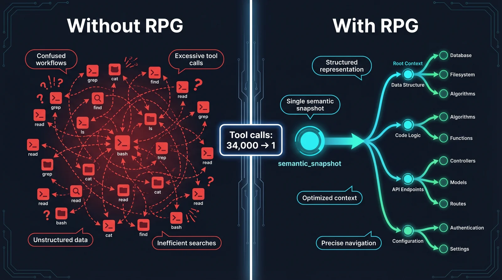
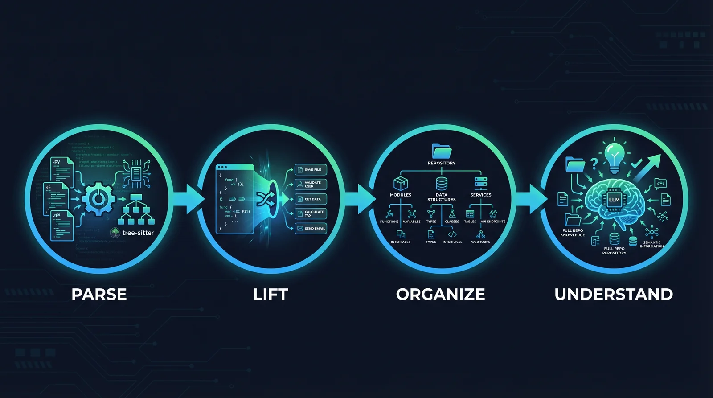
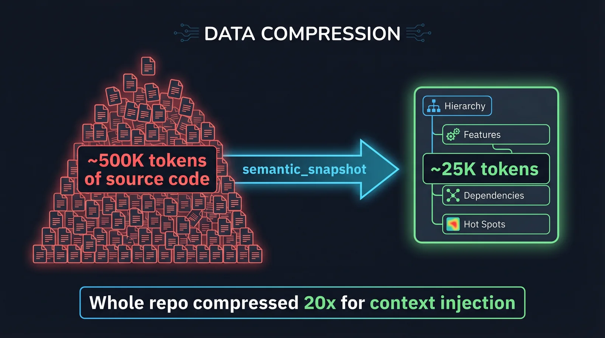
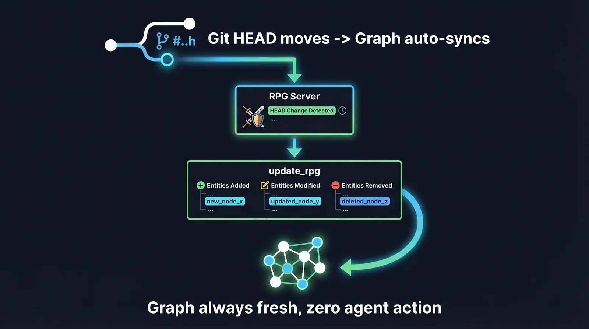
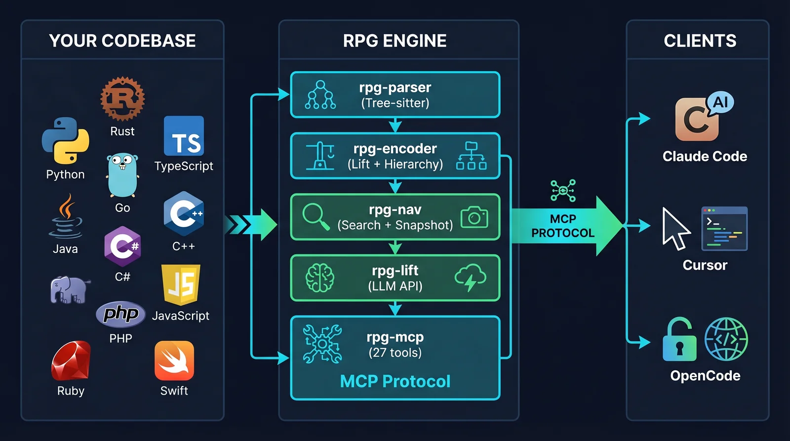

<h1 align="center">rpg-encoder</h1>

<p align="center">
  <strong>Give your AI agent a brain for your codebase.</strong>
</p>

<p align="center">
  <a href="https://github.com/userFRM/rpg-encoder/actions"></a>
  <a href="https://opensource.org/licenses/MIT"></a>
  <a href="https://www.rust-lang.org"></a>
  <a href="https://www.npmjs.com/package/rpg-encoder"></a>
  <a href="https://modelcontextprotocol.io/"></a>
  <a href="https://github.com/userFRM/rpg-encoder/stargazers"></a>
</p>

<br>

AI coding agents waste most of their tool calls fumbling through your codebase with `grep`, `cat`, `find`, and file reads. `rpg-encoder` fixes that. It builds a **semantic graph** of your code with [Tree-sitter](https://tree-sitter.github.io/tree-sitter/) — not just *what calls what*, but *what every function does* — and gives your AI assistant whole-repo understanding via [MCP](https://modelcontextprotocol.io/) in a single tool call.

<p align="center">
  
</p>

---

## Quick Start

```bash
claude mcp add rpg -- npx -y -p rpg-encoder rpg-mcp-server
```

One command. Works with Claude Code, Cursor, opencode, Windsurf, or any MCP-compatible agent. No Rust toolchain, no cloning, no building — `npx` downloads a pre-built binary for your platform.

Then open any repo and tell your agent:

> *"Build and lift the RPG for this repo"*

Your agent handles everything: indexes entities (seconds), reads each function and adds intent-level features (a few minutes), organizes them into a semantic hierarchy, and commits `.rpg/graph.json` for your team.

Once lifted, try:

- *"What handles authentication?"* — finds code even when nothing is named "auth"
- *"Show everything that depends on the database connection"*
- *"Plan a change to add rate limiting to API endpoints"*

---

## How It Works

<p align="center">
  
</p>

1. **Parse** — Tree-sitter extracts entities (functions, classes, methods) and dependency edges (imports, calls, inheritance) from 15 languages.
2. **Lift** — An LLM (your agent, or a cheap API like Haiku) reads each entity and writes verb-object features: *"validate JWT tokens"*, *"serialize config to disk"*.
3. **Organize** — Features cluster into a 3-level semantic hierarchy (Area → Category → Subcategory) that emerges from *what the code does*, not the file tree.
4. **Understand** — `semantic_snapshot` compresses the whole graph into ~25K tokens. Your LLM reads it once and *knows the repo*.

### The semantic snapshot

<p align="center">
  
</p>

Instead of grepping through files, the LLM calls `semantic_snapshot` once and receives:

- **Hierarchy** — every functional area with aggregate features
- **Entities** — every function, class, method grouped by area, with its semantic features
- **Dependency skeleton** — condensed call graph with qualified names
- **Hot spots** — top 10 most-connected entities (the architectural backbone)

~25K tokens covers ~1000 entities. That's 2-3% of a 1M context window — the LLM starts every session already knowing your repo.

### Self-maintaining graph

<p align="center">
  
</p>

Whenever your working tree changes — committed, staged, or unstaged — the MCP server automatically re-syncs before responding to the next query. A changeset hash over `(path, size, mtime)` means repeated saves of the same file trigger one sync, and idle queries trigger none. Reverts are detected too: if a previously-dirty file returns to its HEAD state, the graph is restored.

### Two ways to lift

| Mode | Command | Cost | Who pays |
|------|---------|------|----------|
| **Agent lifting** | *"Build and lift the RPG"* | Subscription tokens | Your Claude Code / Cursor subscription |
| **Autonomous lifting** | `auto_lift(provider="anthropic", api_key_env="ANTHROPIC_API_KEY")` | ~$0.02 per 100 entities | External API key (Haiku, GPT-4o-mini, OpenRouter, Gemini) |

`auto_lift` calls a cheap external LLM directly — your coding subscription never touches the lifting work. Use `api_key_env` to resolve keys from environment variables so they never appear in tool call transcripts.

---

## Architecture

<p align="center">
  
</p>

Eight Rust crates, one MCP server binary, one CLI binary:

| Crate | Role |
|-------|------|
| `rpg-core` | Graph types (RPGraph, Entity, HierarchyNode), storage, LCA algorithm |
| `rpg-parser` | Tree-sitter entity + dependency extraction (15 languages) |
| `rpg-encoder` | Encoding pipeline, lifting utilities, incremental evolution |
| `rpg-nav` | Search, fetch, explore, snapshot, TOON serialization |
| `rpg-lift` | Autonomous LLM lifting (Anthropic, OpenAI, OpenRouter, Gemini) |
| `rpg-build` | Design RPG blueprints from natural-language specs (inverse of encoder) |
| `rpg-cli` | CLI binary (`rpg-encoder`) |
| `rpg-mcp` | MCP server binary (`rpg-mcp-server`) with 28 tools |

---

## MCP Tools (28)

<details>
<summary><strong>Build & Maintain</strong> (4 tools)</summary>

| Tool | Description |
|------|-------------|
| `build_rpg` | Index the codebase (run once, instant) |
| `design_rpg` | Design an RPG blueprint from a natural-language spec (inverse of build) |
| `update_rpg` | Incremental update from git changes |
| `reload_rpg` | Reload graph from disk after external changes |
| `rpg_info` | Graph statistics, hierarchy overview, per-area lifting coverage |

</details>

<details>
<summary><strong>Navigate & Search</strong> (5 tools)</summary>

| Tool | Description |
|------|-------------|
| `semantic_snapshot` | Whole-repo semantic understanding in one call (~25K tokens for 1000 entities) |
| `search_node` | Search entities by intent or keywords (hybrid embedding + lexical scoring) |
| `fetch_node` | Get entity metadata, source code, dependencies, and hierarchy context |
| `explore_rpg` | Traverse dependency graph (upstream, downstream, or both) |
| `context_pack` | Single-call search + fetch + explore with token budget |

</details>

<details>
<summary><strong>Plan & Analyze</strong> (7 tools)</summary>

| Tool | Description |
|------|-------------|
| `impact_radius` | BFS reachability analysis — "what depends on X?" |
| `plan_change` | Change planning — find relevant entities, modification order, blast radius |
| `find_paths` | K-shortest dependency paths between two entities |
| `slice_between` | Extract minimal connecting subgraph between entities |
| `analyze_health` | Code health: coupling, instability, god objects, clone detection |
| `detect_cycles` | Find circular dependencies and architectural cycles |
| `reconstruct_plan` | Dependency-safe reconstruction execution plan |

</details>

<details>
<summary><strong>Semantic Lifting</strong> (11 tools)</summary>

| Tool | Description |
|------|-------------|
| `auto_lift` | One-call autonomous lifting via cheap LLM API (Haiku, GPT-4o-mini, OpenRouter, Gemini) |
| `lifting_status` | Dashboard — coverage, per-area progress, NEXT STEP |
| `get_entities_for_lifting` | Get entity source code for your agent to analyze |
| `submit_lift_results` | Submit the agent's semantic features back to the graph |
| `finalize_lifting` | Aggregate file-level features, rebuild hierarchy metadata |
| `get_files_for_synthesis` | Get file-level entity features for holistic synthesis |
| `submit_file_syntheses` | Submit holistic file-level summaries |
| `build_semantic_hierarchy` | Get domain discovery + hierarchy assignment prompts |
| `submit_hierarchy` | Apply hierarchy assignments to the graph |
| `get_routing_candidates` | Get entities needing semantic routing (drifted or newly lifted) |
| `submit_routing_decisions` | Submit routing decisions (hierarchy path or "keep") |

</details>

---

## Supported Languages

15 languages via Tree-sitter:

| Language | Entity Extraction | Dependency Resolution |
|----------|------------------|----------------------|
| Python | Functions, classes, methods | imports, calls, inheritance |
| Rust | Functions, structs, traits, impl methods | use, calls, trait impls |
| TypeScript | Functions, classes, methods, interfaces | imports, calls, inheritance |
| JavaScript | Functions, classes, methods | imports, calls, inheritance |
| Go | Functions, structs, methods, interfaces | imports, calls |
| Java | Classes, methods, interfaces | imports, calls, inheritance |
| C / C++ | Functions, classes, methods, structs | includes, calls, inheritance |
| C# | Classes, methods, interfaces | using, calls, inheritance |
| PHP | Functions, classes, methods | use, calls, inheritance |
| Ruby | Classes, methods, modules | require, calls, inheritance |
| Kotlin | Functions, classes, methods | imports, calls, inheritance |
| Swift | Functions, classes, structs, protocols | imports, calls, inheritance |
| Scala | Functions, classes, objects, traits | imports, calls, inheritance |
| Bash | Functions | source, calls |

---

## Install

### MCP server (recommended)

```bash
# Claude Code
claude mcp add rpg -- npx -y -p rpg-encoder rpg-mcp-server

# Cursor — add to ~/.cursor/mcp.json
{
  "mcpServers": {
    "rpg": {
      "command": "npx",
      "args": ["-y", "-p", "rpg-encoder", "rpg-mcp-server"]
    }
  }
}
```

The server auto-detects the project root from the current working directory — no path argument needed.

<details>
<summary><strong>CLI</strong></summary>

```bash
npm install -g rpg-encoder

# Build a graph
rpg-encoder build

# Query
rpg-encoder search "parse entities from source code"
rpg-encoder fetch "src/parser.rs:extract_entities"
rpg-encoder explore "src/parser.rs:extract_entities" --direction both --depth 2
rpg-encoder info

# Autonomous lifting via API
rpg-encoder lift --provider anthropic --dry-run  # estimate cost
rpg-encoder lift --provider anthropic           # lift with Haiku (~$0.02/100 entities)

# Incremental update
rpg-encoder update

# Pre-commit hook (auto-updates graph on commit)
rpg-encoder hook install
```

</details>

<details>
<summary><strong>Build from source</strong></summary>

```bash
git clone https://github.com/userFRM/rpg-encoder.git
cd rpg-encoder && cargo build --release
```

Then point your MCP config at `target/release/rpg-mcp-server`.

</details>

---

## Documentation

- [How RPG Compares](docs/comparison.md) — honest comparison with GitNexus, Serena, Repomix, and others
- [Paper Fidelity](docs/paper_fidelity.md) — algorithm-by-algorithm comparison with the research paper
- [Use Cases](use_cases.md) — practical examples of what RPG enables
- [CHANGELOG](CHANGELOG.md) — release history

---

## Inspirations & References

rpg-encoder is built on the theoretical framework from the RPG-Encoder research paper, with original extensions inspired by tools across the code intelligence landscape:

- **[RPG-Encoder paper](https://arxiv.org/abs/2602.02084)** (Luo et al., 2026, Microsoft Research) — semantic lifting model, 3-level hierarchy construction, incremental evolution algorithms, formal graph model `G = (V_H ∪ V_L, E_dep ∪ E_feature)`.
- **[GitNexus](https://github.com/abhigyanpatwari/GitNexus)** — precomputed relational intelligence, blast radius analysis, Claude Code hooks. Showed that a code graph tool must be invisible to be essential.
- **[Serena](https://github.com/oraios/serena)** — symbol-level precision via LSP. Demonstrated that real-time code awareness matters more than batch analysis.
- **[TOON](https://github.com/toon-format/toon)** — Token-Oriented Object Notation for LLM-optimized output.

This is an independent implementation. All code is original work under the MIT license. Not affiliated with or endorsed by Microsoft.

---

## License

[MIT](LICENSE)
